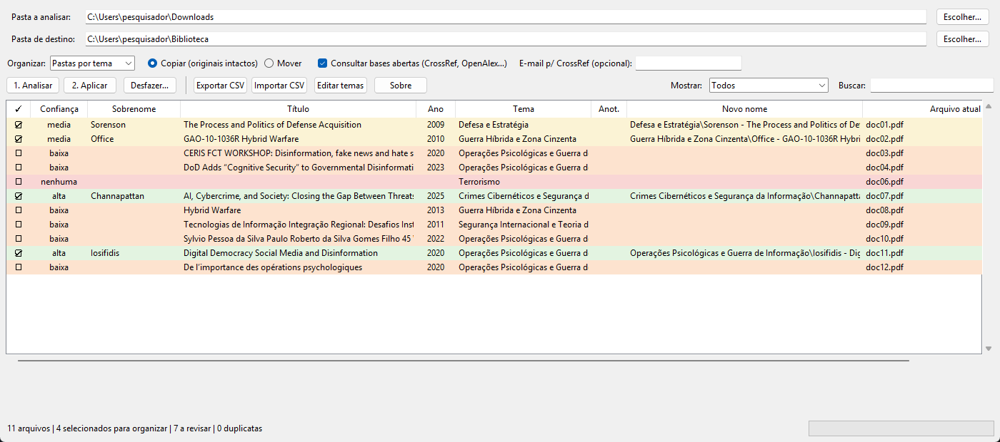

# Estante

[](https://doi.org/10.5281/zenodo.23131607)
[](LICENSE)

Organizador de livros, artigos e textos acadêmicos para desktop. Você indica uma pasta (bagunçada) e a Estante:

1. **lê** cada PDF/EPUB e identifica **autor, título e ano** — por DOI/ISBN em bases abertas
   (CrossRef, OpenAlex, Open Library, Google Books) ou, sem identificador, pelos metadados e pela capa do arquivo;
2. **sugere um tema** a partir de palavras-chave que você mesmo define;
3. **acha duplicatas** (mesmo arquivo ou mesma obra) e **preserva as cópias com anotações e marcações**;
4. mostra tudo numa **tabela para revisão** — nada acontece antes de você conferir;
5. **copia ou move** para `Destino\<Tema ou Autor>\Sobrenome - Título - Ano.pdf`, com **log para desfazer**.

Tudo roda localmente. A única comunicação externa é a consulta opcional às bases bibliográficas abertas
(pode ser desligada: aí a análise usa só os arquivos). Sem IA, sem conta, sem telemetria.



## Instalação

Requer Python 3.10+ (o Tkinter já vem com o Python no Windows e no macOS; no Linux, instale `python3-tk`).

```bash
pip install -r requirements.txt
python -m estante
```

## Como usar

1. **Pasta a analisar** e **Pasta de destino** → *Escolher…*
2. Escolha **Pastas por tema**, **Pastas por autor** ou **Sem subpastas**, e **Copiar** (recomendado) ou **Mover**.
3. **1. Analisar.** A tabela usa cores pela confiança da identificação:

   | Cor | Confiança | Significado |
   |---|---|---|
   | verde | alta | DOI/ISBN encontrado e conferido com o texto do arquivo |
   | amarelo | média | identificação plausível, vale uma olhada |
   | laranja | baixa | palpite (metadados, capa); revise |
   | vermelho | nenhuma | nada encontrado (geralmente PDF escaneado) |
   | azul | manual | você editou |
   | cinza | — | duplicata (fica de fora) |

4. **Revise:** duplo clique edita sobrenome, título, ano e tema (Tab pula para o próximo campo);
   clique na coluna ✓ (ou Espaço) inclui/exclui; duplo clique em *Arquivo atual* abre o arquivo;
   botão direito permite abrir a pasta, marcar vários e definir o tema de vários de uma vez.
   Filtro **"A revisar"** mostra só o que precisa de atenção.
   Prefere planilha? **Exportar CSV**, edite no Excel/LibreOffice, **Importar CSV**.
5. **2. Aplicar.** O log fica em `Destino\_estante_logs\`; **Desfazer…** reverte uma operação inteira
   (cópias só são apagadas se continuarem idênticas — se você já anotou alguma, ela é mantida).

### Temas

**Editar temas** abre `temas.json`: cada tema é um nome e uma expressão regular com palavras-chave
separadas por `|`. Os temas que vêm de exemplo são de Estudos Estratégicos e Segurança — troque pelos da sua área.
Depois de salvar, analise de novo (é rápido: os resultados ficam em cache).

### Onde ficam os dados

Configurações, temas e cache em `%APPDATA%\Estante` (Windows) ou `~/.config/Estante` (Linux/macOS).

## Regras de segurança

- Nada é apagado. No modo *copiar*, os originais não são tocados; cada cópia é conferida por hash (SHA-1).
- Um arquivo que mudou desde a análise é pulado.
- Nomes repetidos ganham ` (2)`, ` (3)`…; um arquivo diferente já existente no destino nunca é sobrescrito.
- Caminhos longos do Windows (> 260 caracteres) são suportados.

## Limitações

- PDFs escaneados sem camada de texto não são identificados (rode um OCR antes).
- Bases bibliográficas às vezes devolvem a obra *citada* por um DOI do texto; a Estante compara o título
  devolvido com o conteúdo do arquivo e rebaixa a confiança quando não confere — mas revise os amarelos.
- Relatórios, leis e documentos institucionais raramente têm DOI/ISBN: costumam cair em "baixa".

## Desenvolvimento

```bash
python -m unittest discover tests
```

Estrutura: `arquivos.py` (leitura local, hash, duplicatas) · `metadados.py` (identificação) ·
`temas.py` · `analise.py` (orquestra) · `organizar.py` (planejar, aplicar, desfazer, CSV) · `gui.py` (Tkinter).

## Como citar

Se a Estante for útil na sua pesquisa, cite-a — os dados estão em [CITATION.cff](CITATION.cff)
(no GitHub, botão *Cite this repository*).

> Lavandoski da Silva, L. G. (2026). *Estante: organizador de livros, artigos e textos acadêmicos*
> (Versão 0.1.0) [Software]. Zenodo. https://doi.org/10.5281/zenodo.23131607

## Licença

Copyright (C) 2026 Luiz Gustavo Lavandoski.
[GNU AGPL-3.0](LICENSE) — a mesma da [PyMuPDF](https://github.com/pymupdf/PyMuPDF), usada para ler os PDFs.
Você pode usar, estudar, modificar e redistribuir; versões modificadas distribuídas precisam manter o código aberto
sob a mesma licença.
